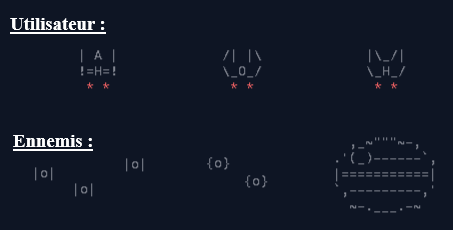
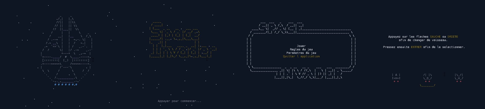
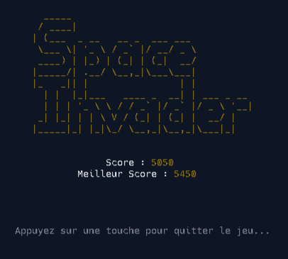

# Space Invader

<br />

<ol>
  <li>
    <a href="#but-du-projet">But du projet</a>
  </li>
  <li>
    <a href="#réalisation">Réalisation</a>
    <ul>
      <li><a href="#langage">Langage</a></li>
      <li><a href="#cahier-des-charges">Cahier des charges</a></li>
      <li><a href="#prototype">Prototype</a></li>
    </ul>
  </li>
</ol>

<br />
<br />

## But du projet
<p>
  Le projet consiste en la réalisation d'un jeu vidéo inspiré de Space Invaders, dans le cadre de la formation en Génie électrique et informatique industriel (GEII) sur une durée de 3 mois (novembre 2022 - janvier 2023). 
  <br /><br />
  Notre objectif était de développer un environnement de jeu stable, avec une interface utilisateur intuitive et des graphismes de qualité, ainsi qu'un système de contrôle de personnage réactif et fluide. Nous avons utilisé le langage C pour programmer notre jeu.
  <br /><br />
  Le but principal de ce jeu est de piloter un personnage et d'éviter des ennemis en utilisant différents vaisseaux alliés et ennemis inspirés de l'univers de Star Wars. Ce choix d'univers ajoute une difficulté supplémentaire à la réalisation du projet en intégrant des mécaniques uniques.
</p>
      
<br /><br /><br />

## Réalisation


### Langage
```c
#include <ncurses.h>
```

<p>
  Pour le projet de jeu vidéo Space Invaders, nous avons utilisé la librairie ncurses.h pour gérer les entrées utilisateur et l'affichage en mode console. Cette librairie fournit des fonctions pour gérer les fenêtres, les couleurs, les curseurs, les entrées clavier et d'autres fonctionnalités liées à l'interface utilisateur en mode console. 
  <br /><br />
  Cela nous a permis de créer une interface utilisateur réactive et personnalisable, sans avoir besoin de dépendre d'une bibliothèque graphique. En utilisant cette librairie, nous avons pu développer un jeu simple, stable et facile à utiliser pour les joueurs.
</p>

<br /><br />

### Cahier des charges
<p>
  Le programme dispose d’animations servant de transitions, comme l’écran de chargement qui amène au menu principal ou encore l’arrivé du boss final. Le menu principal permet de relier les quatre fonctions principales : le lancement du jeu, les règles, les paramètres ainsi que l’arrêt du jeu.
  <br /><br />
  L’utilisateur peut déplacer son vaisseau sur l’axe X, vaisseau choisissable via les paramètres, avec l’utilisation des touches « D ou d » et « Q ou q » afin de déplacer le vaisseau sur l’axe X. « Q » étant pour aller à gauche et « D » pour aller à droite, l’utilisation de la barre espace afin de tirer des lasers avec notre propre vaisseau. L’appuis de la touche « P ou p » permet l’interruption du programme à tout moment ainsi que sa reprise.
  <br /><br />
  Il y a différents types d’ennemis, chaque ennemi ont des fonctionnalités différentes tel que : tirer des lasers, se déplacer sur l’axe X et You encore suivre parfaitement l’utilisateur.
  <br /><br />
  Ci-dessous, les différents vaisseaux utilisables par l’utilisateur ainsi que les vaisseaux des ennemis :
<div align="center">
  
</div>
  <br /><br />
  La difficulté du jeu évolue avec le score de l’utilisateur, en effet les parties sont divisées en cinq vagues plus difficiles les unes que les autres. De plus, le vaisseau de l’utilisateur est très fragile, une seule collision avec n’importe quel laser ou n’importe quel ennemi entraînera la fin de la partie et donc la défaite. La seule solution de victoire est de réussir à vaincre le boss de la dernière vague. 
  <br /><br />
  Un score est comptabilisé durant la partie, incrémenté à chaque vaisseau détruit, il est affiché en permanence et affiché à la fin du jeu avec le meilleur score toute parties confondu.
</p>

<br /><br />

### Prototype
<div align="center">
  
  
</div>
